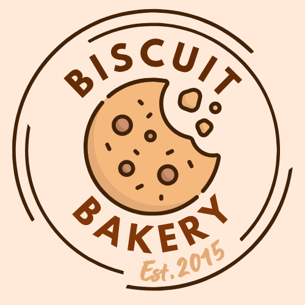
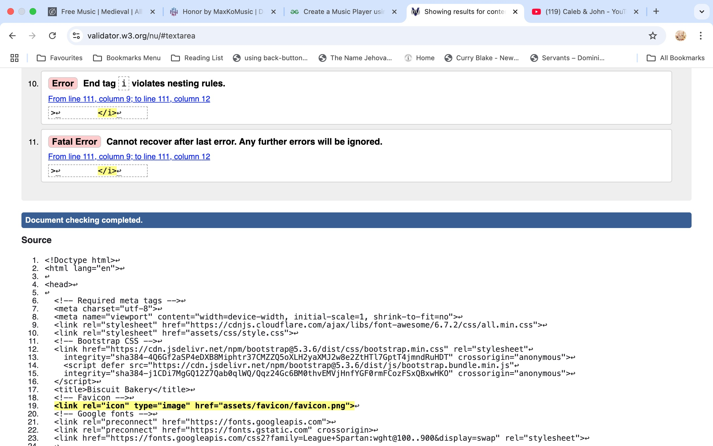

# milestone-project-1

# Contents 
1. [Rationale](#rationale)
2. [Inspiration](#inspiration)
3. [Development](#development)
1. [User story 1](#user-story-1) 
2. [User story 2](#user-story-2)
3. [User story 3](#user-story-3)
4. [User design/experience](#user-designexperience)
   1. Colour palatte for design
   2. Bootstrap code for form and table
   3. Wireframes for each display size (within each page below)
   4. Using summary and details tags/elements
5. [Homepage](#homepage)
6. [Prices Page](#prices)
7. [Order page](#order-page)
8. [About page](#about-page)
9. [Testimonies](#testimony-page)
10. [Using Github to clone the repository](#using-github-to-clone-the-repository)
11. [Links/images used references](#linksimages-used-and-references) 
12. [Issues and Bugs](#issues-and-bugs)
13.  [Validation For CSS and HTML](#validation) 
14. [Deploying the website](#deploying-the-website)

# Rationale
-Disclaimer : THIS IS A FICTIONAL BAKERY -
A British biscuit bakery is commemorating its 10th year and wants to showcase their exquisite biscuit selection with a fresh new website.
They want to be able to use this to ensure potential customers (both corporate and public) know what they sell and order via an order page.
They do delivery or pick up. 
 
The purpose of creating this website is to ensure the family run business meets the needs of its current and potential customers. They want to very much be in the 21st century and utilizing technology is a great way to achieve this. Expanding from their current address to online orders enables them to reach a wider customer base.

The users all have differing needs and wants. From fast turn-around for delivery to an easily accessible website to place orders.
Alongside a dropdown menu option for the order page, the users are taken to a new page informing them of a successful order after they place one.

The gallery images provide the users with a taste of the selection on offer and the menu makes navigation easy to use. From clearly defined sections to an easy to read font. 

This website has been made mobile friendly and scales up to accommodate larger screens. Thus, being responsive to portrait and landscape orientations. 

The footer has much needed contact information from the location and address to the telephone number. This ensures that customers/users have a fall back option.  

## Inspiration 
Why do this project about biscuits? Well, in our household we eat biscuits. Every day. A lot. 
It seemed like a good idea. Something familiar and unobtrusive. Something that would be an easy choice for the first milestone. 

> Please Note:  
I don't live at Biscuit lane or Biscuit Avenue

## Development
### Logo Design
The logo and favicon are simple and clutter free. A cartoon cookie with readable font were seleted.
A clean look with a logo that isn't too busy and communicates effectively what the company does.

There were other designs made which were rejected as this seemed like the most well suited option at the end.

Below are the various options and designs showing the process...
### Logo Designs

### Favicon designs

### Adding ID's for CSS

In order to style the labels on the order form I had to create ID's for each dropdown in the styles css page.

---

---

### User story 1
An estate agent wants to mark their one year anniversary of being in business by throwing a biscuit party for its workers. Profits are through the roof. They live a biscuits throw away from the bakery so can pick up a batch order when it's ready. 

### User story 2
A museum wants to showcase the British history of food and wants to give visitors an authentic experience with popular biscuits to give away.
This is one time they don’t think taking the biscuit is a bad thing.
Testimonies of the quality and being able to seamlessly order is what they need. The museum manager will be making a call for next day delivery.

### User story 3
A mother wants a selection of fine British biscuits to offer to her daughter and friends when they come round to celebrate the passing of her driving test. She is looking for an easy to navigate website to check out prices and see the gallery before she comes to pick them up.

## User design/experience
* Ensure all pages include responsive design for all screen sizes
* Use Bootstrap for the order form and buttons on order page
* Wireframes for mobile, tablet and desktop
### Colour Palette 

Bootstrap code for form and table

Wireframes for each display size

### Using the "summary" and "details" tag/element for dropdown effect
I got the details tag from two places 
https://developer.mozilla.org/en-US/docs/Web/HTML/Reference/Elements/details
and 
https://www.youtube.com/shorts/Y03AqLiBMGk
This saved me from having to use javascript and kept things neat and tidy on the webpage.
Espcially benefical for the FAQ section.
The user can easily access the extra information by a siple click on the heading/tag.

Even though the center tag still works it has been officially deprecated and so I had to use text align instead to center the tag on the middle of the page.
https://developer.mozilla.org/en-US/docs/Web/HTML/Reference/Elements/center

## Homepage

### Favicon
 * Use Free Fontawesome icon
### Header with logo
  

* Navigation bar (to include);
   * Images page with biscuits on offer
   * History of company (about page)
   * Prices page
   * Order page (with button and form)
   * Testimony page

### Main Body
 Carousel with images (5-6)
> company slogan

## Footer 
* Contact Information 
   * Telephone number, address.
* Social Media Links

---
---

## Gallery

### Favicon
 * Use Free Fontawesome icon
### Header with logo
  

* Navigation bar (to include);
   * Images page of biscuits on offer
   * History of company (about page)
   * Prices page
   * Order page (with button and form)
   * Testimony page

<strong>(Please note: the '*ordersuccess.html'* page is hidden from the menu as it only needs to appear once an order is actually placed)<strong>

### Main Body
 Carousel with images (5-6)
> company slogan

## Footer 
* Contact Information 
   * Telephone number, address.
* Social Media Links

---
---

## Prices

 

## Favicon
### Header with logo
  

* Navigation bar (to include);
   * Images page with types of biscuits on offer
   * History of company (about page)
   * Prices page
   * Order from page (with button and form)
   * Testimony page

## Main body
* Table with costs
   
   
   | Biscuit  | Size |  Cost |
   | ---      | ---  |  ---  |
   | Assortment | Large |  £15       | 
   | Shortbread | Medium | £12   | 
   | Custard creams| Small | £8   | 
        This is a responsive table
## Footer 
* Contact Information 
   * Telephone number, address.
* Social Media Links

---
---

## Order Page

### Favicon
### Header with logo
  

* Navigation bar (to include);
   * Images of biscuits on offer
   * History of company (about page)
   * Prices page
   * Order page (with button and form)
   * Testimony page

### Main Body
 * Form with dropdown list
 * Submit button
 * Feedback response for user once submitted "successfully submitted order" or "order on its way"

## Footer 
* Contact Information 
   * Telephone number, address.
* Social Media Links

---
---

## About Page

## Favicon
### Header with logo
  

* Navigation bar (to include);
   * Images page with types of biscuits on offer
   * History of company (about page)
   * Prices page
   * Order page (with button and form)
   * Testimony page

### Main Body
 Carousel with images (3)
> Company Slogan

Information about loyalty scheme and rewards

## Footer 
* Contact Information 
   * Telephone number, address.
* Social Media Links
---
---

## Testimony Page

## Favicon
### Header with logo
  

* Navigation bar (to include);
   * Images page of boxes and types of biscuits on offer
   * History of company (about page)
   * Prices page
   * Order page (with button and form)
   * Testimony page

### Main Body
 Carousel with images (5-6)
> Customer quotes/reviews 

## Footer 
* Contact Information 
   * Telephone number, address.
* Social Media Links
---

### Using Github to clone the repository
---

### Links/images used and references
For gift/present emojis https://emojidb.org/gist-emojis
emojidb.org
Adobe Stock Images  
Canva  
Pexels

References to images/photos for milestone project...

Photo by <a href="https://unsplash.com/@bensimmo?utm_source=unsplash&utm_medium=referral&utm_content=creditCopyText">Ben Simmonds</a> on <a href="https://unsplash.com/photos/brown-and-white-i-love-you-print-wooden-blocks-ai8Kgj4lxW8?utm_source=unsplash&utm_medium=referral&utm_content=creditCopyText">Unsplash</a>

Photo by <a href="https://unsplash.com/@marylooo?utm_source=unsplash&utm_medium=referral&utm_content=creditCopyText">Maria Kovalets</a> on <a href="https://unsplash.com/photos/chocolate-chip-cookies-cooling-on-a-cooling-rack-N0VzhsrjBzQ?utm_source=unsplash&utm_medium=referral&utm_content=creditCopyText">Unsplash</a>
      
Photo by <a href="https://unsplash.com/@behy_studio?utm_source=unsplash&utm_medium=referral&utm_content=creditCopyText">Behnam Norouzi</a> on <a href="https://unsplash.com/photos/a-box-filled-with-chocolate-cookies-and-cookies-P_s6gT2QDW8?utm_source=unsplash&utm_medium=referral&utm_content=creditCopyText">Unsplash</a>
      
      

Free preview images from ADOBE STOCK...

<a href="https://unsplash.com/s/photos/boxed-biscuits?license=free" target="_blank" rel="noopener">Photo by Behnam Norouzi on Unsplash</a>

<a href="https://unsplash.com/s/photos/order-biscuits?license=free" target="_blank" rel="noopener">Photo by asagi on Unsplash</a>

 <a href="https://unsplash.com/photos/a-cookie-with-sprinkles-on-a-brown-background-lo3conW0BK8" target="_blank" rel="noopener">Photo of cookie by Nik Owens on Unsplash</a>

<a href="https://unsplash.com/@nik_owens" target="_blank" rel="noopener">Photo of cookies by Nik Owens on Unsplash</a> 

<a href="https://unsplash.com/s/photos/white-choc-cookie" target="_blank" rel="noopener">Photo by Andrijana Bozic on Unsplash</a>

 <a href="https://unsplash.com/photos/a-bunch-of-cookies-that-are-on-a-rack-kl54LH8jZaQ" target="_blank" rel="noopener">Photo by Michael Carruth on Unsplash</a>

<a href="https://www.pexels.com/photo/homemade-gingerbread-cookies-on-wooden-surface-6119146/" target="_blank" rel="noopener">Photo by Taryn Elliott</a> 

<a href="https://unsplash.com/s/photos/white-choc-cookie" target="_blank" rel="noopener">Photos by Andrijana Bozic on Unsplash</a>

<a href="https://www.pexels.com/photo/person-putting-cookie-on-wooden-surface-6119147/" target="_blank" rel="noopener">Photos by Andrijana Bozic on Unsplash (cookie)</a>

---
Tutorials/websites/videos used to help with the contruction of the website are as follows:

Tables: 
[https://www.w3schools.com/html/html_table_styling.asp]
(https://www.w3schools.com/html/html_table_styling.asp)

[https://developer.mozilla.org/en-US/docs/Learn_web_development/Core/Styling_basics/Tables]

Image sizing:
[https://www.shecodes.io/athena/9455-how-to-make-images-fit-the-browser-window-while-resizing#googlgite_vignette]

[https://www.youtube.com/watch?v=mPZLxhgTKCU]

*"HTML & CSS for Absolute Beginners: Responsive images"*
[https://www.youtube.com/watch?v=gn0OaxS1OdY]

*"Figma Wireframe Tutorial for Beginners (2025)"*
[https://www.youtube.com/watch?v=iyrEStiTZh0]

Bootstrap Cards
[https://getbootstrap.com/docs/5.0/components/card/]
Centering a card
[https://www.educative.io/answers/how-to-center-cards-in-bootstrap-4]

## Programs/languages/applications/websites used in the construction;
<ul>
<li>W3Schools</li>
<li>Aliena Cai</li>
<li>MDN Docs</li>
<li>Bootstrap</li>
<li>HTML</li>
<li>CSS</li>
<li>Javascipt (with Bootstrap script</li>
<li>Figma</li>
<li>Canva</li>
<li>Google Fonts</li>
<li>Fontawesome</li> 
<li>Notes on Mac</li>
<li>TINY PNG</li>
<li>Shecodes.io</li>
<li>ByteGrad</li>
</ul>
---

### Issues and Bugs
Trying to centre the table itself posed a problem (not just the text within). Thankfully this tutorial came to the rescue:
[https://elementor.com/blog/how-to-center-a-table-in-css/]

This video I used when the Carousel wasn't working properly for Bootstrap. 
*"Carousel not working in Bootstrap 5 (SOLVED)"*
I also encountered problems with the dropdown menu on the home page not working. This video solved the issue.
*'Bootstrap 5 dropdown not working (SOLVED)*
[https://www.youtube.com/watch?v=t5XjrpUEjGY]

I had white space at the bottom of my pages pushig the footer up with its content and this was distracting. This video seemed to fix the majority of pages with this issue.

*Keep Footer at the Bottom of the Page: HTML & CSS (2024)* [https://www.youtube.com/watch?v=RYImAil3lgo]
(Dmitry Mayorov)

File and folder paths were another big issue.
In fact, most likely the biggest.
Not being able to push commits as somehow it stopped working. Thus, forcing me to uninstall VSCode and reinstall it. I even had to delete some folders and files and rearrange them on my desktop computer. I downloaded the zip file from the Github project repository and I am grateful to my mentor who advised me to commit often. This saved me hours if not days of starting all over again. :)

With Bootstrap there was an issue when things didn't seem to work. The j.script was either in the wrong place or it was outdated/not matching. 

I wanted to have a hamburger menu to match my wireframes but somehow this was more challenging and elusive. Fortunately the Bootstrap code gives us one in the navbar. 

Lighthouse flagged SEO as an issue. With the icons and also accessibilty. I have spaced out the social media icons in the footer so that should aid the user. Not everything was altered to the desired wireframe images. 

<em>Please note: the labels and option/select tags don't have a calculation function/operation for the total on the order page, as this requires additional languages. (Apart from Bootstrap), this project was solely working with HTML and CSS and not Javacript<em>

...Extra Information

With the use of the summary and details tag/elements I decided to remove the FAQ section from the order page and for clarity, place the FAQ section within the home page instead. 
The reason for doing this is to prevent ambiguity for the user and show clearly WITHOUT having to navigate to another page, the needed information at a moments notice.

## Validation

Validation For CSS and HTML

CSS returned the following:

 
Addressing validaton and correcting errors

After centering and aligning the logo on each page and making the font bigger and also including details/summary tags. Along with changing thr backgroun image I ran the lighthouse test again.

For the mobile lighthouse returned...

For desktop lighthouse returned ...

The next part was the HTML validation...

For the index page...

Next the gallery page...

The About page...

Prices...

Testimonies...

Order page...

And the order success page...

### Deploying the website

<ol>
<li>Go to "Pages" on the Gitub settings in the chosen repository.</li>
<li> Deploy from "main" branch.</li>
<li>Save changes.</li>
</ol>
 

For further help refer to the following: 

[https://everhour.com/blog/how-to-host-website-on-github/#:~:text=Go%20to%20the%20website%20repository,Save%20your%20publishing%20source]

[https://docs.github.com/en/pages/quickstart]

Thankyou for reading this Readme file. 

